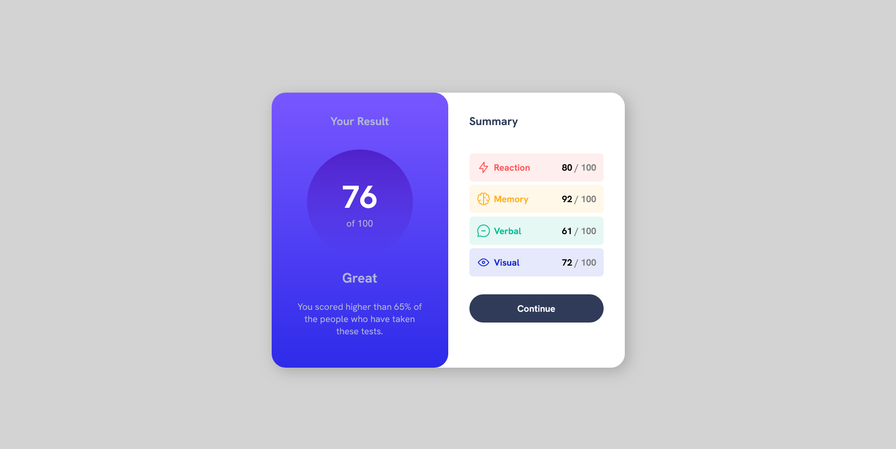

# Frontend Mentor - Results summary component solution

Hello!

This is a solution to the [Results summary component challenge on Frontend Mentor](https://www.frontendmentor.io/challenges/results-summary-component-CE_K6s0maV).

## Table of contents

-   [Overview](#overview)
    -   [Screenshot](#screenshot)
    -   [Links](#links)
-   [My process](#my-process)
    -   [Built with](#built-with)
    -   [What I learned](#what-i-learned)
-   [Author](#author)git

### Screenshot

### Links

-   Solution URL: [On Vercel](https://frontendmentor-testfeedbackpage-waj2.vercel.app/)

## My process

Done the basic HTML5, added the CSS using SASS.
There is a commented part in the HTML5 witch refers to the part where is is not needed the JS.
I have added javascript to the file, where it is possible to generate the code dinamically.

### Built with

-   HTML5
-   SCSS
-   Flexbox
-   JavaScript

### What I learned

Learned some JS commands in what concerns creating new content inside the HTML.

I had some trouble in uploading all the folders containing all the elements so I just decided to put them all in the same folder in order to correct the problem and updates the links in the JSON, CSS and HTML files. (Any help on that subject would be welcome)
